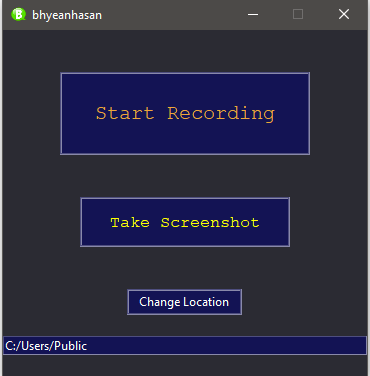
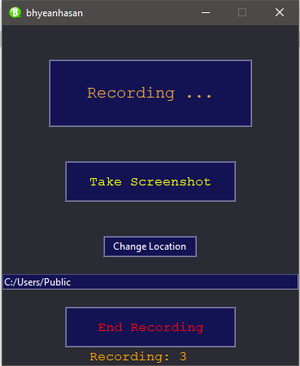
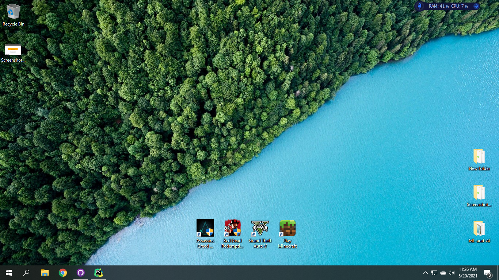

# Screenshot Taker

 




* for linux you may need to install ["scrot"](https://en.wikipedia.org/wiki/Scrot)

  -  in arch based systems type: ```pacman -S scrot``` 

  -  or in Ubuntu/debian derivatives type ``` sudo apt-get install scrot```
